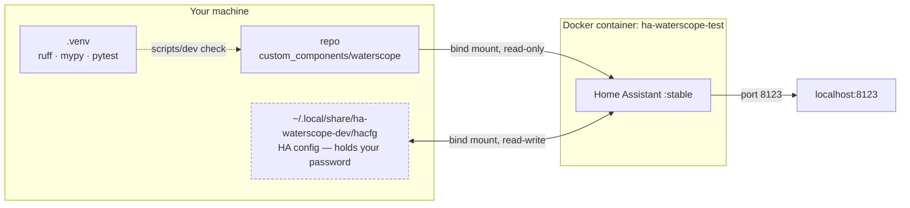
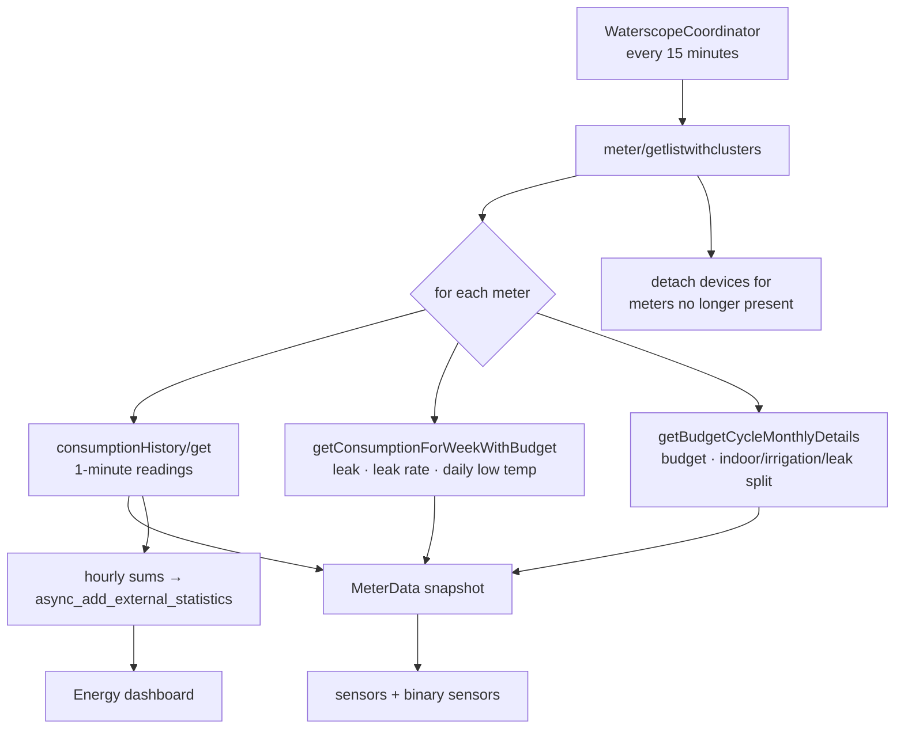
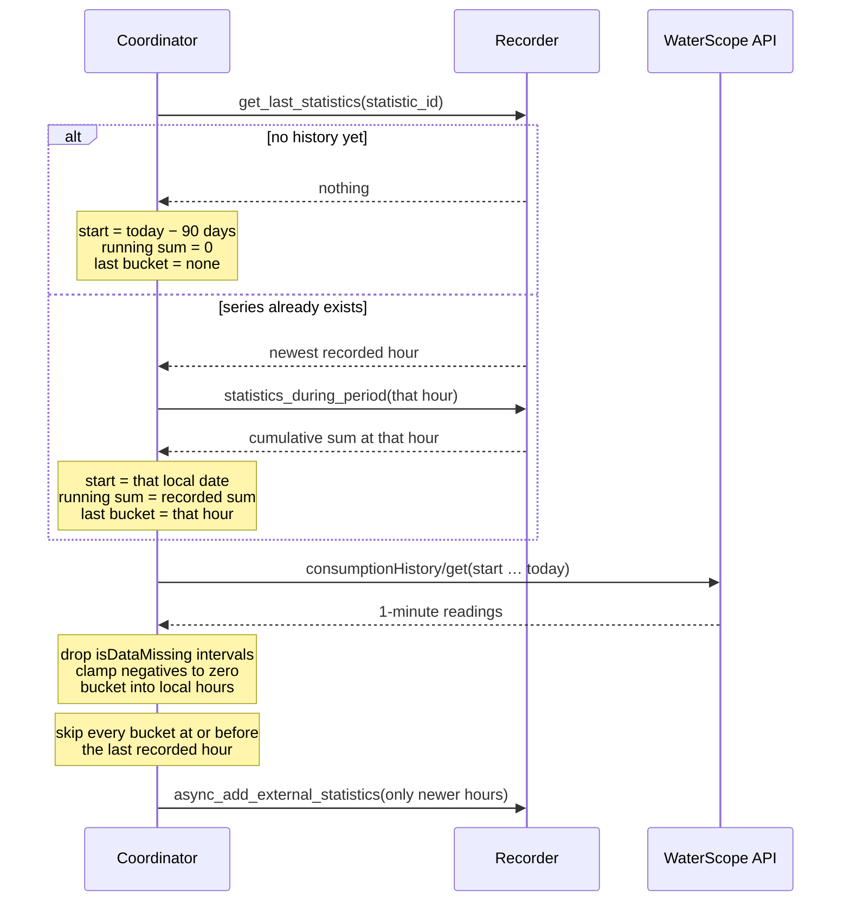
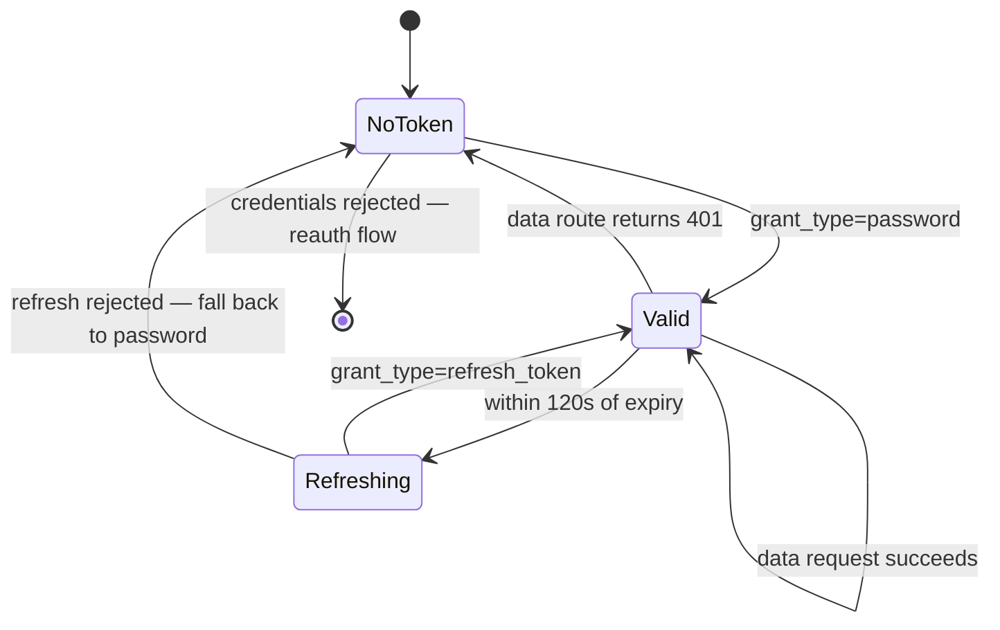

# Development

Everything goes through `scripts/dev`. Run it with no arguments for the full list.

```bash
scripts/dev setup     # one-time: create .venv and install the toolchain
scripts/dev check     # ruff + mypy + pytest — exactly what CI runs
scripts/dev up        # start a real Home Assistant with this integration mounted
```

Then open <http://localhost:8123>.

## Quick reference

| Command | What it does |
|---|---|
| `scripts/dev setup` | Creates `.venv` and installs ruff, mypy and the HA test harness. |
| `scripts/dev check` | Lint, type check and test. Run this before pushing. |
| `scripts/dev test [args]` | Just pytest — `scripts/dev test tests/test_api.py -k leak` works. |
| `scripts/dev lint` / `fmt` | `ruff check` / `ruff check --fix`. |
| `scripts/dev types` | mypy, using Home Assistant core's own settings. |
| `scripts/dev hassfest` | HA's manifest, icon and translation validation. |
| `scripts/dev up` / `down` / `restart` | Manage the live Home Assistant container. |
| `scripts/dev logs` | Follow the log, filtered to waterscope lines and errors. |
| `scripts/dev where` | Print the paths, port and timezone in use. |
| `scripts/dev adopt <dir>` | Import an existing HA config directory. |

## Live testing

`scripts/dev up` runs `ghcr.io/home-assistant/home-assistant:stable` with
`custom_components/waterscope` **bind-mounted read-only from this repo**. Edit code here,
run `scripts/dev restart`, and the change is live — no copying.

Add the integration through the UI once, and it persists across restarts.



The dashed box is the reason the config directory lives outside the repo: Home Assistant
writes your WaterScope password into it in plain text.

Two things that matter:

- **Timezone.** The API returns naive local wall-clock timestamps, so the container's zone
  must match the meter's or every reading lands in the wrong hour. The script takes it from
  `/etc/timezone`; override with `WATERSCOPE_DEV_TZ`.
- **Where the config lives.** Home Assistant's config directory is deliberately kept
  **outside the repo**, at `~/.local/share/ha-waterscope-dev/hacfg`, because
  `.storage/core.config_entries` holds your WaterScope password in plain text and must
  never sit in a git working tree. Override with `WATERSCOPE_DEV_CONFIG`.

The container writes that directory as root, so some files under `.storage` end up
root-owned. Copying it around needs `sudo`.

## Requirements

- **Docker.** On WSL this needs Docker Desktop → Settings → Resources → WSL Integration
  switched on for this distro, otherwise `docker` is only an inert shim.
- **Python 3.13+**, which is what Home Assistant requires.

## Two gotchas worth knowing

**C extensions need a compiler that exists.** Linuxbrew's Python hardcodes `gcc-12` when
building C extensions, and that compiler is not installed here — without an override,
installing the toolchain fails while building the `lru-dict` wheel. `scripts/dev setup`
detects `gcc-13` and sets `CC` accordingly. Any manual `pip install` into `.venv` that
compiles C needs the same treatment.

**Test and runtime Home Assistant versions differ, by design.**
`pytest-homeassistant-custom-component` pins its own Home Assistant (2026.2.3 at the time
of writing) while the container runs `:stable` (2026.8.1). This was checked and is safe for
the APIs in use — `StatisticMetaData`, `StatisticMeanType` and `VolumeConverter.UNIT_CLASS`
are identical in both. Re-check it whenever the recorder statistics API is touched, since
that is where the two versions are most likely to diverge.

## How it fits together

### One poll

The coordinator runs every 15 minutes and drives everything from a single pass over the
account's meters.



The two secondary routes are best-effort: if either fails the poll still succeeds, and only
the entities fed by that route go unavailable. A failure of the consumption route fails the
whole update, because that is the point of the integration.

### Importing statistics without corrupting them

This is the subtle part, and where the integration is easiest to get wrong. External
statistics carry a **cumulative** `sum`, so a batch must continue from whatever total
preceded it — never restart at zero — and must not rewrite hours that already exist.



Two failure modes this shape rules out:

- **Restarting the sum.** Each poll re-fetches a window overlapping hours already stored.
  Accumulating those from zero would leave a cliff where the rewritten hours meet the older
  ones — the sum is cumulative across the entire series, not per batch.
- **Never backfilling.** The 90-day import runs as a background task, and polls do not
  touch statistics until it has finished. Otherwise the first poll would write today's
  hours, and the import would then conclude the series was already up to date.

### Token lifecycle

One password grant, then refresh tokens, with the stored password only as a fallback.



Access tokens last about 30 minutes and refresh tokens about 14 days. The 120-second margin
exists so a token cannot lapse between the check and the request landing.

## Layout

```
custom_components/waterscope/   the integration
  api.py                        WaterScope mobile API client (no HA imports)
  coordinator.py                polling, statistics import, device lifecycle
  entity.py                     shared base: device info, availability
  sensor.py / binary_sensor.py  entity definitions
tests/                          pytest suite, >95% coverage required by CI
scripts/dev                     this tooling
```
